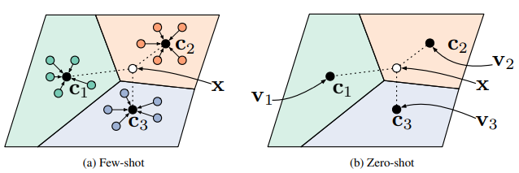
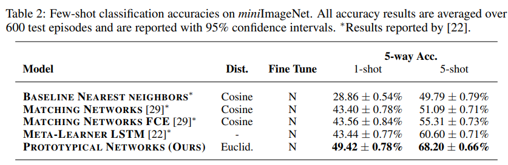

# Prototypical Networks for Few-shot Learning 论文复现
## ProtoNet Networks论文简介




prototypical networks属于小样本学习中基于度量的算法。它将support
set的同一类样本的所有embedding的质心作为这一类的prototype。query直接用自己的embedding去找最近的prototype，从而完成分类。

## 原论文效果


## 实验环境
- [Python-3.7]

- [PaddlePaddle-2.1.2]

- [Cuda-11.2 and Cudnn-8.1]

## 实验步骤
（一）数据处理\
&emsp;数据集下载\
&emsp;数据集预处理:  将miniImageNet数据集按照csv文件分别读取训练集、验证集和测试集。并进一步将其进行采样，划分出每个任务的support
set和query set。（详见data文件夹）

    
（二）修改参数配置

- `epoch` 训练的epoch个数
- `lr` 学习率
- `n_gpu` gpu选择
- `data_root` 数据所在路径
- `episode_size` 每次优化的任务数
- `train_episode` 在训练阶段每个epoch的任务数
- `test_episode` 在测试阶段每个epoch的任务数
- `way_num` 训练时类别数量
- `shot_num` 支持集中每个类所含样本数量
- `query_num` 查询集中每个类所含样本数量
- `test_way` 测试时类别数量
- `use_memory` 是否使用内存


（三）模型训练

    $ python /script/train_5w_1s.sh  用于训练5way-1shot
    $ python /script/train_5w_5s.sh  用于训练5way-5shot


（四）模型测试

    $ python /script/test_5w_1s.sh  用于测试5way-1shot 
    $ python /script/test_5w_5s.sh  用于测试5way-5shot


## 模型性能
我们复现的方法在5way-1shot上超过论文的性能0.32%，在5way-5shot上超过论文的性能0.18%。并且我们的复现是使用6000个任务进行测试得到的结果，原文中使用的是600个任务，因此我们的结果具有更高的可信度。

**miniImageNet Dataset**

|  Setups  | 1-Shot 5-Way | 5-Shot 5-Way |   
|:--------:|:------------:|:------------:|
|   Paper  |  49.42±0.78  |  68.20±0.66  | 
|   Ours   |  49.74±0.25  |  68.38±0.21  | 


## Reference

```bibtex
@inproceedings{snell2017prototypical,
  title={Prototypical networks for few-shot learning},
  author={Snell, Jake and Swersky, Kevin and Zemel, Richard},
  booktitle={Proceedings of the 31st International Conference on Neural Information Processing Systems},
  pages={4080--4090},
  year={2017}
}
```